## 管理模块

### module

在 webpack 中，每个文件都是一个模块，除了 webpack 认识的 JS 和 JSON 文件，CSS，图片等都是模块，模块之间通过不同方式的语法会产生依赖关系，例如：

- ES6+的`import`；
- CommonJS 的`require`；
- AMD 的`define`和`require`；
- css/sass/less 文件中的`@import`，`url(...)`；
- html 文件中可替换元素的`src`属性

webpack 通过**loader**来支持多种语言和预处理器语法编写的模块，这样就可以处理各种非 JS 内容。

## 处理 HTML

### HtmlWebpackPlugin

> [html-webpack-plugin](https://github.com/jantimon/html-webpack-plugin)

之前的配置是直接在 webpack 的打包输出目录下创建一个 html 页面，并手动引入 webpack 输出的 JS 文件。尽管引入了 WDS，可以自动打开并刷新页面，但是这只是一个 bundle 文件的情况，如果项目模块增多，需要多个 bundle 时，自然无法再手动将 bundle 文件添加到 html 中，所以我们需要一个插件能够将 bundle 文件自动添加到 html 中。

HtmlWebpackPlugin 是在 webpack 打包过程中自动生成 html 页面，并且自动将资源文件，例如 webpack 打包输出的 JS 文件插入到 html 页面中的插件。根据配置，这个插件还能支持根据自定义的模板来生成 html 文件，或者根据`ejs`的语法规则来替换一些变量。

```shell
yarn add html-webpack-plugin -D
```

#### 配置项

| 配置项               | 类型                                                 | 默认值                                   | 用法                                                                                                                                                                                                                                                          |
| -------------------- | ---------------------------------------------------- | ---------------------------------------- | ------------------------------------------------------------------------------------------------------------------------------------------------------------------------------------------------------------------------------------------------------------- |
| `title`              | String                                               | `Webpack App`                            | html 的 title                                                                                                                                                                                                                                                 |
| `filename`           | String                                               | `'index.html'`                           | 生产的 html 页面的文件名                                                                                                                                                                                                                                      |
| `template`           | String                                               | `src/index.ejs`                          | 模板页面，如果存在`src/index.ejs`就是用它                                                                                                                                                                                                                     |
| `templateContent`    | String\|Function\|`false`                            | `false`                                  | 代替模板使用以提供嵌入式模板                                                                                                                                                                                                                                  |
| `templateParameters` | Boolean\|Object\|Function                            | `false`                                  | 覆盖模板中使用的参数                                                                                                                                                                                                                                          |
| `inject`             | `true|false` <br />`'head'|'body'`                   | `false`                                  | `true`/`"body"`会将所有的 JS 资源放在`<body>`标签的底部；`"head"`或`false`会将 JS 资源放在`<head>`标签中                                                                                                                                                      |
| `scriptLoading`      | `'blocking'` <br />`'defer'`                         | `'blocking'`                             | 设置 JS 加载的方式                                                                                                                                                                                                                                            |
| `favicon`            | String                                               | `` | 将给定的 favicon 路径添加到 html 中 |
| `meta`               | Object                                               | { }                                      | 为 html 模板页面添加 meta，参见 —— [HEAD#meta](https://github.com/joshbuchea/HEAD#meta)                                                                                                                                                                       |
| `base`               | Object\|String \| `false`                            | `false`                                  | 为 html 模板页面添加 base 标签                                                                                                                                                                                                                                |
| `minify`             | Boolean \| Object                                    | `true`                                   | 根据 webpack 的`mode`配置来判断当前环境，由于`mode`默认是`production`生产环境，所以这个值默认也是`true`，也就是对 html 进行压缩；也可以使用一个对象来配置具体的压缩项目，参见 —— [minification](https://github.com/jantimon/html-webpack-plugin#minification) |
| `hash`               | Boolean                                              | `false`                                  | 如果为`true`，则将唯一的 webpack 编译哈希值附加到所有包含的脚本和 CSS 文件中。这对于清除缓存很有用                                                                                                                                                            |
| `cache`              | Boolean                                              | `true`                                   | 仅在文件改变时重新生成                                                                                                                                                                                                                                        |
| `showErrors`         | Boolean                                              | `true`                                   | 错误详细信息将写入 HTML 页面                                                                                                                                                                                                                                  |
| `chunks`             | Array of String                                      | `?`                                      | 自定义添加的模块                                                                                                                                                                                                                                              |
| `chunksSortMode`     | `"none"`<br />`"auto"`<br />`"manual"`<br />Function | `"auto"`                                 | 允许控制在将块包含到 HTML 中之前应如何对其进行排序                                                                                                                                                                                                            |
| `excludeChunks`      | Array of String                                      |                                          | 打包时忽略的模块，例如测试模块等                                                                                                                                                                                                                              |
| `xhtml`              | Boolean                                              | `false`                                  | 如果设置成`true`，`link`标签的插入形式将是自动闭合的形式，也就是闭合的箭头括号前多一个斜杠                                                                                                                                                                    |

### 模板配置

> [Writing Your Own Templates](https://github.com/jantimon/html-webpack-plugin#writing-your-own-templates)

如果不使用自定义的模板，HtmlWebpackPlugin 配置最简单，直接`new HtmlWebpackPlugin()`就可以了。

```javascript
const HtmlWebpackPlugin = require("html-webpack-plugin");

module.exports = {
  ...
  plugins: [new HtmlWebpackPlugin()],
}
```

但是实际项目往往基本都需要自定义模板，HtmlWebpackPlugin 可以根据自定义的模板来生成 html 文件，并将 webpack 的输出资源插入到 html 页面中。

HtmlWebpackPlugin 本身内置识别`.ejs`文件的 loader，如果你的模板使用`.ejs`来定义，那么就无需安装其他 loader 了。当然了，HtmlWebpackPlugin 也提供了许多其它类型的模板可以选择，参见 —— [template option](https://github.com/jantimon/html-webpack-plugin/blob/master/docs/template-option.md#the-template-option)。

- 如果没有为模板文件指定任何 loader，默认使用内置的 loader；
- 如果在`template`这个配置项中根据语法为特定的模板文件指定 loader，那么就使用那个指定的 loader；
- 如果在`webpack.config.js`中指定相应的 loader 来匹配文件类型，那么就会禁用内置的 loader

接下来新建一个`public`文件夹，将之前 dist 目录的`index.html`移入其中，然后把`<body>`里之前引入的`main.js`干掉，将这个`index.html`作为模板页面配置在 HtmlWebpackPlugin 中，然后再把 dist 目录删掉。

```javascript
const HtmlWebpackPlugin = require("html-webpack-plugin");

module.exports = {
  ...
  plugins: [new HtmlWebpackPlugin({
    template:"./public/index.html"
  })],
}
```

接下来，需要将 webpack-dev-server 配置里的`contentBase`删除掉，已经不再需要提供静态文件了，现在依据`html-loader`和`html-webpack-plugin`能自动生成一个 html 页面作为 webpack-dev-server 的调试页面了，即使执行生产环境的`yarn build`命令也能依据靠它们将 html，icon 等静态文件输出到打包目录`dist`中。

执行`yarn start`命令，就可以看到自动在浏览器中打开了页面，通过 devtool 也能看到 bundle 文件已经自动插入到指定的 html 中了。

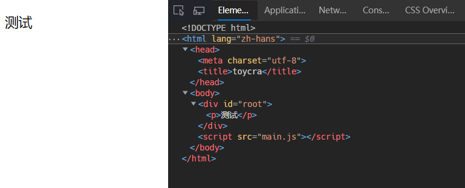

可以为 html 页面设置一个 favicon，HtmlWebpackPlugin 会根据`favicon`配置的路径找到文件然后添加到 html 中。

```javascript
plugins: [
  new HtmlWebpackPlugin({
    template: "./public/index.html",
    favicon: "./public/favicon.ico",
  }),
],
```

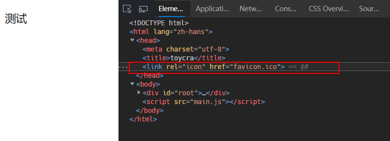

## 处理 CSS

### style-loader 和 css-loader

在 React 开发过程中如果要使用 CSS，最常见的做法是在当前组件中通过`import`引入 CSS 文件，但是 CSS 最终需要被放在 HTML 页面中才能被加载，解析。

要将 CSS 自动插入到 html 页面中，需要使用`style-loader`，光引入`style-loader`还不行，得需要一个根据`import`语法解析 CSS 的 `css-loader`，`css-loader`负责解析 CSS 文件中的样式生成字符串，然后`style-loader`默认创建`<style>`标签塞入 CSS 字符串，最后插入到页面中。

```shell
yarn add style-loader css-loader -D
```

```javascript
//简单配置
module.exports = {
  ...
  module:{
    rules:[
      ...
      {
        test: /\.css$/i,
        use: [
          {
            loader: "style-loader",
          },
          {
            loader: "css-loader",
          },
        ],
      },
    ]
  }
}
```

默认是以`<style>`的形式将组件中引入的 CSS 插入到 DOM 中

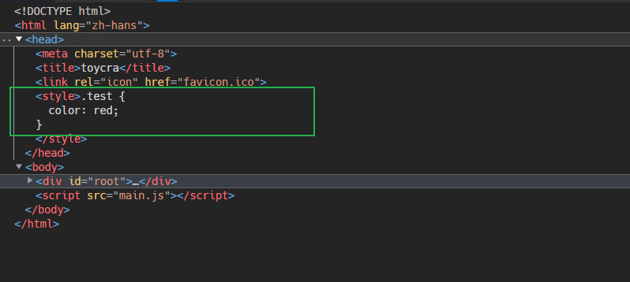

#### style-loader 配置

> [style-loader/#options](https://webpack.docschina.org/loaders/style-loader/#options)

| 配置项       | default    | 含义                                                                                                                                                |
| ------------ | ---------- | --------------------------------------------------------------------------------------------------------------------------------------------------- |
| `injectType` | `styleTag` | 把样式插入到 html 的方式，默认是通过`<style>`标签，可以选择`linkTag`，也就是`<link>`标签                                                            |
| `attributes` | `{}`       | 写入`<style>`或者`<link>`标签的属性                                                                                                                 |
| `insert`     | `head`     | 插入`<style>`或者`<link>`标签的位置，默认就是在 html 的`<head>`中                                                                                   |
| `base`       |            | `base` 允许你通过指定一个比 _DllPlugin1_ 使用的 css 模块 id 大的值，来避免应用程序中的 css (或者 DllPlugin2 的 css) 被 DllPlugin1 中的 css 覆盖问题 |
| `esModule`   | `false`    | 默认情况下，`style-loader` 生成使用 Common JS 模块语法的 JS 模块；如果指定使用 ES module，有利于 tree shaking                                       |

#### css-loader 配置

> [css-loader/#配置](https://github.com/webpack-contrib/css-loader#modules)

| 配置项          | 默认值  | 含义                                                                                         |
| --------------- | ------- | -------------------------------------------------------------------------------------------- |
| `url`           | `true`  | 默认启用对`url`/`image-set`动态加载资源的处理                                                |
| `import`        | `true`  | 默认支持`@import`规则                                                                        |
| `modules`       | `false` | 默认是基于文件名选择是否支持 CSS Modules                                                     |
| `esModule`      | `true`  | `css-loader` 生成默认使用 ES 模块语法                                                        |
| `importLoaders` | `0`     | 设置在 CSS 加载程序之前应用的 loader 的数量                                                  |
| `sourceMap`     | `false` | 取决于 webpack 的`devtool`设置项，只在`devtool`的值不是`eval`和`false`的时候这个配置项才有用 |

需要特别关注的是`modules`这个配置，它和[CSS Modules](https://github.com/css-modules/webpack-demo)相关。因为单页面应用开发中使用 CSS 一个最大的问题就是不好维护，特别容易出现命名混乱，样式覆盖等问题，使用 CSS Modules 可以有效避免这些问题。

`css-loader`默认是支持 CSS Modules 的，它是根据在 React 中`import`引入的 CSS 文件名来判断这个 CSS 文件是不是一个模块，如果是就去使用内置的解析规则去替换一些 class 名称等。正则匹配文件名规则是`/\.module\.\w+$/i`，也就是忽略大小写，文件名中包含`.module`就被当作一个 CSS 模块。

> Note：如果你`eject`过 CRA 的代码就会发现，CRA 就是采用`css-loader`这种默认配置的方式。

因此如果你将一个 CSS 文件名命名为`xxx.module.css`这种形式以后，在 React 组件中使用`import`引入这个 CSS 文件的时候，必须使用 CSS Modules 指定的规则，也就是把导入的 CSS 看作一个对象，在`className`中去使用，如下：

```css
/* styles.module.css */
.test {
  color: red;
}
```

```jsx | pure
import React, { Component } from 'react';
import styles from './styles.module.css';

export default class extends Component {
  render() {
    return (
      <div>
        <p className={styles.test}>12121212</p>
      </div>
    );
  }
}
```

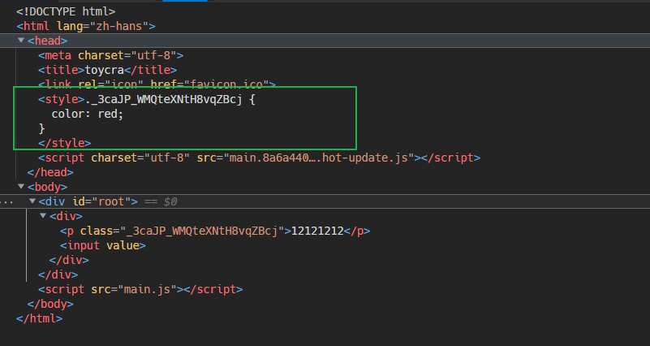

除了使用默认配置， `modules`可供选择的设置还有这些：

| 属性值      | 含义                                                                                                                  |
| ----------- | --------------------------------------------------------------------------------------------------------------------- |
| `true`      | 全部使用 CSS Modules，设置成这个以后，在 React 中引入 CSS 就必须按照上面那种 CSS Modules 的写法                       |
| `false`     | 禁用 CSS Module                                                                                                       |
| `"local"`   | 和`true`是一样的                                                                                                      |
| `"global"`  | ？？？                                                                                                                |
| Object Type | `modules`可以设置成一个对象，属性如下表所示，见 —— [Object](https://webpack.docschina.org/loaders/css-loader/#object) |

以`modules`Object 形式配置`localIdentName` 来看，`localIdentName` 可以指定替换 React 中`className`的名称，`localIdentName` 采用[loader-utils#interpolatename](https://github.com/webpack/loader-utils#interpolatename)中的模板字符串替换形式。推荐是开发环境使用`"[path][name]__[local]"`，生产环境使用`"[hash:base64]"`，配置一下试试。

```javascript
modules: {
  localIdentName: isDevelopment
    ? "[path][name]__[local]"
  : "[hash:base64]",
},
```

开发环境的生成结果：

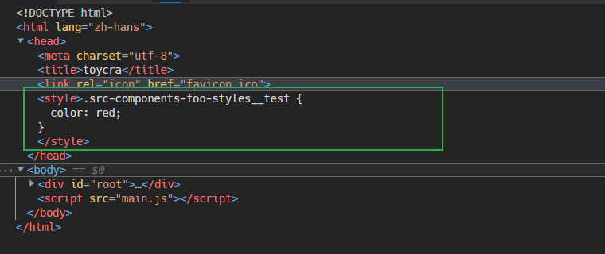

`yarn build`打包的结果：

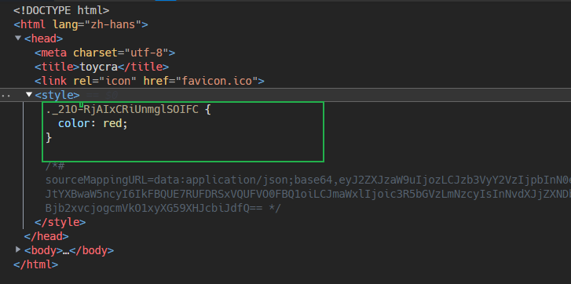

### 提取 CSS 文件

生产环境中需要将 React 中`import`引入的 CSS，或者 less 等导出为单个 CSS 文件，通过`<link>`标签插入到 DOM 中，推荐使用[`mini-css-extract-plugin`](https://github.com/webpack-contrib/mini-css-extract-plugin)这个 webpack 插件，也就是开发环境使用`style-loader`，然后需要生产环境打包的时候使用`mini-css-extract-plugin`。

```shell
yarn add mini-css-extract-plugin -D
```

修改上文的`style-loader`配置，同时配置`mini-css-extract-plugin`内置的 loader 和 plugin

```JavaScript
const MiniCssExtractPlugin = require("mini-css-extract-plugin");

module.exports = function (env) {
  const isDevelopment = env.NODE_ENV === "development";
  const isProduction = env.NODE_ENV === "production";
  return {
    ...
    module: {
      rules: [
        ...
        {
          test: /\.css$/i,
          use: [
            isDevelopment && {		//开发环境使用style-loader
              loader: "style-loader",
            },
            isProduction && {			//生产环境使用mini-css-extract-plugin
              loader: MiniCssExtractPlugin.loader,
              options: {
                publicPath: '../',
              },
            },
            {
              loader: "css-loader",
              options: {
                modules: {
                  localIdentName: isDevelopment
                    ? "[path][name]__[local]"
                    : "[hash:base64]",
                },
              },
            },
          ].filter(Boolean),
        },
      ],
    },
    plugins: [
      ...
      isProduction &&							//还需要配置启用plugin部分
        new MiniCssExtractPlugin({
          filename: "static/css/[name].[contenthash:8].css",
          chunkFilename: "static/css/[name].[contenthash:8].chunk.css",
        }),
      ,
    ].filter(Boolean),
  };
};
```

执行`yarn build`看一下输出的文件，已经在`dist`目录下根据配置的路径生成了 css 文件

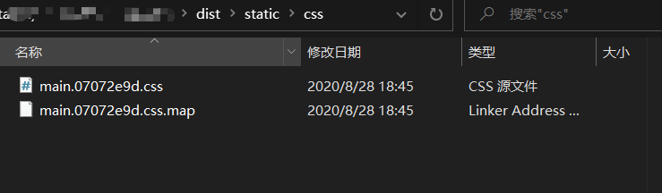

再检查 html 页面，发现 CSS 文件按照路径通过`<link>`的形式插入

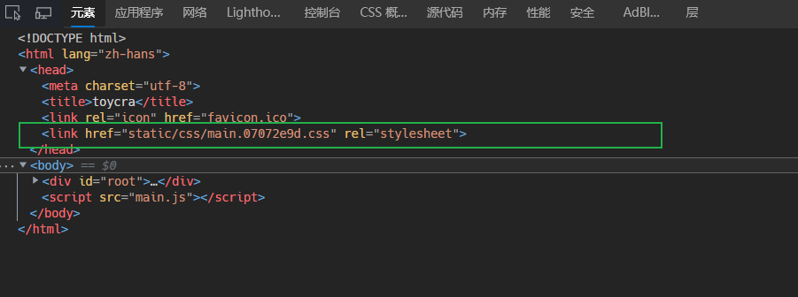

## 处理 CSS 中的字体

## 处理图片

如果在 CSS 中使用`url`引入一个图片，或者在 React 中直接`import`一个图片，都需要额外的 loader 来解析图片，有两种 loader 来处理图片资源：`file-loader`和`url-loader`。

```shell
yarn add file-loader url-loader -D
```

### file-loader

> [file-loader#配置项](https://github.com/webpack-contrib/file-loader#options)

`file-loader`支持解析 React 中`import`的图片路径以及在 CSS 中使用`url`引入的图片，默认情况下，`file-loader`会对引入的图片重新生成一个 hash 字符串作为替换名称。

```javascript
module.exports = {
  ...
  modules:{
    rules:[
      ...
      {
        test: [/\.bmp$/, /\.gif$/, /\.jpe?g$/, /\.png$/, /\.svg$/],	//注意不要忘了svg
        loader: "file-loader",
      }
    ]
  }
}
```

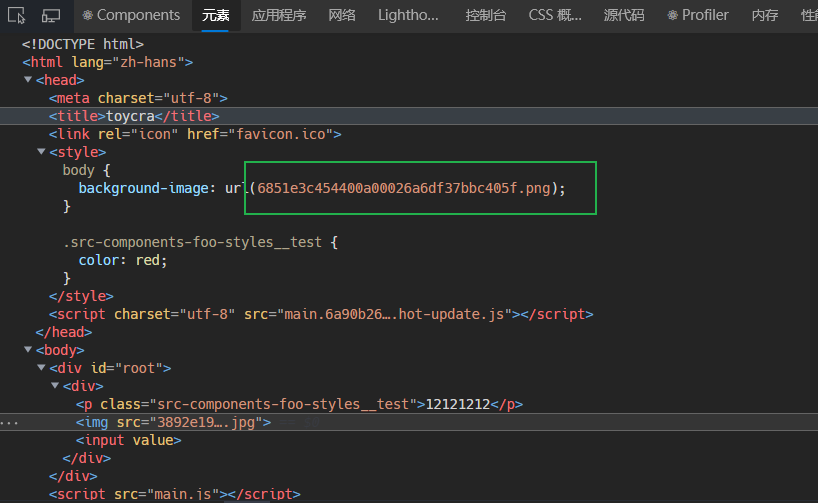

#### 配置输出目录

如果不对`file-loader`配置打包后的图片输出目录，在开发环境通常没有影响，但是在执行`yarn build`以后，图片都会被放在 webpack 的`output`指定的根目录下面。所以必须为`file-loader`指定打包后的输出目录。

可以通过`name`和`outputPath`指定图片输出目录

```javascript
module.exports = {
  ...
  modules:{
    rules:[
      ...
      {
        test: [/\.bmp$/, /\.gif$/, /\.jpe?g$/, /\.png$/],
        loader: "file-loader",
        options: {
          name: "[name].[hash:8].[ext]",
          outputPath: "static/images",
        },
      }
    ]
  }
}
```

这样的配置结果，最终打包输出图片的目录会和 html 在同级目录的`static/images`下

```shell
	├─ dist
    ├─ favicon.ico
    ├─ index.html
    └─ static
      ├─ css
      │	├─ main.css
      └─ images
        └─ picture.jpg
```

但是这样的打包目录对于在 CSS 中通过`url`引入的图片来说，它也会被放到`static/images`目录下，同时路径前缀也是`static/images`，所以 CSS 就找不到图片了。这种情况我目前找到两种解决方式：

第一种：在之前提取 CSS 的插件`mini-css-extract-plugin`的 loader 配置中直接指定 CSS 的公共资源目录，这样在打包完了以后，CSS 中引用的资源路径会在`static/images`前面再加上`../../`的前缀，这样路径就对了

```javascript
isProduction && {			//生产环境使用mini-css-extract-plugin
  loader: MiniCssExtractPlugin.loader,
  options: {
    publicPath: '../../',
  },
},
```

第二种：通过`file-loader`的`name`的函数配置方式解决，`name`的函数会接收三个参数：

- `resourcePath`：原图片的完整路径
- `resourceQuery`：图片路径串接的参数

这种方式我个人想法是对于在 CSS 中引用的图片，设置固定格式的文件名，例如`cssimage-xxx.jpg`，然后`name`函数在接收到文件名根据正则表达式去匹配，如果满足是 CSS 中引用的图片文件名格式，那么返回的文件名路径就可以使用特定的形式来指定，例如`../../static/images/[name].[hash:8].[ext]`，如果不是就使用`static/images/[name].[hash:8].[ext]`。

### url-loader

`url-loader`是`file-loader`的升级，对于在`limit`限制内的小图片，`url-loader`将图片转成[Base64 编码](https://zh.wikipedia.org/wiki/Base64)的数据，并通过

[**Data URLs**](https://developer.mozilla.org/zh-CN/docs/Web/HTTP/data_URIs)放在页面中，或者 CSS 中，而对于超过了`limit`限制的图片，可以指定后续通过`file-loader`处理，也可以直接为其指定输出路径。

#### Data URLs

以`data://`形式开头的 Data URLs 协议是众多 URI 协议中的一种，URI 本身就是统一资源标识符的缩写，所以 Data URLs 也是唯一标识一个资源的形式。

Data URLs 的形式如下：

> `data:[<mediatype>][;base64],<data>`

- mediatype，也就是[图片的文件类型](https://developer.mozilla.org/zh-CN/docs/Web/HTTP/Basics_of_HTTP/MIME_types#%E5%9B%BE%E7%89%87%E7%B1%BB%E5%9E%8B)
- `;base64`这部分字符串时可选的，也就是说你可以直接将某些 mediatype 的文本嵌入到 Data URLs 中，例如 HTML，SVG 等

- data，可能是被 Base64 编码以后的数据，也可能是纯文本

通过 Data URLs 协议引入的图片通常如下所示：

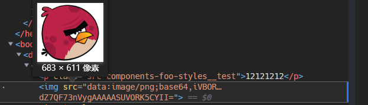

至于 Base64，是使用 ASCII 码中的 64 个可打印字符（`a~z`，`A~Z`，`0~9`以及`+`和`/`，最后还有一个`=`后缀）来编码数据，这种编码的特点是将原数据的每 6 个`bit`用一个打印字符来表示，也就是一个字符只能表示`3/4`的数据量，所以经过 Base64 编码的数据，最终会比原始数据大`1/3`左右。

将 Base64 编码应用在图片上的话，好处有以下这些：

- 不用在开发时候管那些麻烦的图片路径配置问题；

- 对于小图片，直接嵌入 HTML 页面或者 CSS 中，节省 HTTP 请求，相当于缩短页面资源在请求过程中的排队时间；
- 图片直接使用 Base64 编码以后，在 JS 中获取图片可以避免一些跨域使用图片的问题

当然，也有一些局限性：

- 如果把大图片都转成 Base64 塞到 HTML 或者 CSS 里，会导致页面渲染速度明显减慢，而且还会卡；

- 浏览器无法针对 Base64 编码的图片单独缓存，要么缓存整个 CSS 或者 HTML 文件；
- 由于 Base64 上面说的比原图片体积大的问题，需要针对服务器开启`gzip`压缩传输，这样和原图开启`gzip`传输基本差不多了

所以一般是推荐一些页面的小图标，小 logo 这些不容易改变，且图片体积小的情况下使用 Base64 编码。

#### url-loader 配置

> [url-loader#配置项](https://github.com/webpack-contrib/url-loader#options)

`url-loader`默认是无限制的把所有图片都经 Base64 编码转换，所以必须配置大小限制`limit`，`limit`的单位是字节，推荐是`10KB`以下的图片进行 Base64 编码；对于大于`10KB`的图片，使用指定文件名的形式来配置。

```javascript
module.exports = {
  ...
  modules:{
    rules:[
      ...
      {
        test: [/\.bmp$/, /\.gif$/, /\.jpe?g$/, /\.png$/],
        loader: "url-loader",
        options: {
          limit: 10 * 1024,
          name: "static/images/[name].[hash:8].[ext]",
        },
      }
    ]
  }
}
```

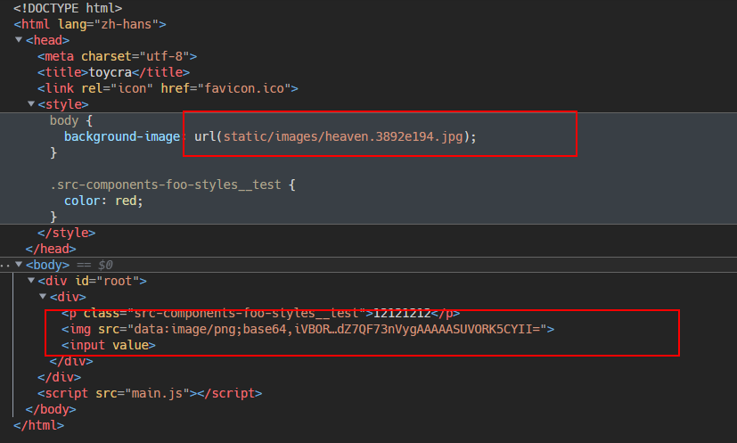

### 处理 SVG

#### SVG 模块

SVG 一般在网页中可以通过三种方式使用：

- 直接使用`<svg>`标签嵌入 HTML
- `import`以后放在``中加载
- 通过 CSS 的`url`引入

开发的时候，一般不会选择第一种方式，不好看也不利于维护。所以一般是做成模块，通过``或者`url`形式去引入。所以在上面的配置中，还需要添加一种 SVG 的文件格式匹配`/\.svg$/i`。

单个的 SVG 文件一般都比较小，如果按照上面的`url-loader`配置，SVG 一般会被转成 Base64 然后通过 Data URLs 放在``或者`url`里面，但是 SVG 本身是可以直接放在 Data URLs 里的，如果转成 Base64 以后再放进去，数据量变大了`1/3`，徒增 HTML 或者 CSS 文件的体积，这是反向优化！所以不可取，对 SVG 需要额外的处理。

`url-loader`是推荐了一个[`mini-svg-data-uri`](https://github.com/tigt/mini-svg-data-uri)来处理 SVG，这个工具可以移除原 SVG 文件中注释，空格等乱七八糟没用的字符，同时会对 SVG 中的字符进行 URL 编码，避免一些旧的 IE 上不兼容的问题，然后再通过`url-loader`被放在 Data URLs 里。

```shell
yarn add mini-svg-data-uri -D
```

```javascript
const svgToMiniDataURI = require('mini-svg-data-uri');

module.exports = {
  module: {
    rules: [
      ...{
        test: /\.svg$/i,
        use: [
          {
            loader: 'url-loader',
            options: {
              generator: content => svgToMiniDataURI(content.toString()),
            },
          },
        ],
      },
    ],
  },
};
```

```jsx | pure
import logo from 'logo.svg';

export default class extends Component {
  render() {
    return ;
  }
}
```

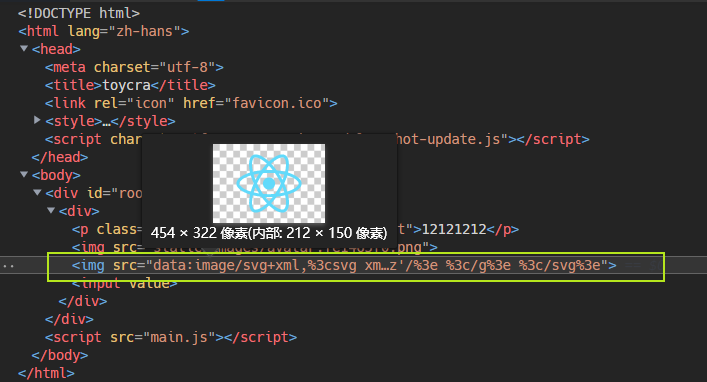

#### SVG 组件

如果想直接在页面里使用这个 SVG 图片，而不是放在``标签里，推荐使用 airbnb 出品的[`babel-plugin-inline-react-svg`](https://github.com/airbnb/babel-plugin-inline-react-svg#babel-plugin-inline-react-svg)，这个插件我在测试的时候，会和上面的`url-loader`有一定的冲突。它提供的功能是：

- 将 SVG 文件转换成 React 组件
- 使用[SVGO](https://github.com/svg/svgo/)优化压缩 SVG

```shell
yarn add babel-plugin-inline-react-svg -D
```

```javascript
module.exports = {
  module: {
    rules: [
      {
        test: /\.m?jsx?$/,
        exclude: /(node_modules)/,
        use: {
          loader: "babel-loader",
          options: {
            presets: ["@babel/preset-env", "@babel/preset-react"],
            plugins: [
              "@babel/plugin-proposal-class-properties",
              "inline-react-svg",		//注意到这是一个babel的plugin引入
          ].filter(Boolean),
        },
     },
     ...
  }
}
```

测试一下，SVG 可以通过组件的方式被插入到页面中了。

```jsx | pure
import Logo from 'logo.svg';

export default class extends Component {
  render() {
    return <Logo />;
  }
}
```

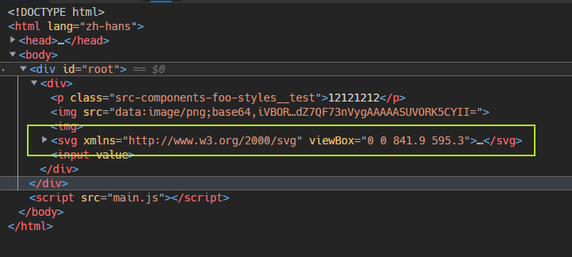

#### svg-sprite

上面的 SVG 方案都是一次引入一个 SVG 图像，这种方式在页面图标多的时候非常麻烦，20 多个图标都得 20 个`import`。

SVG sprite 是利用和以前 CSS sprite 相同的方案思路，将多个 SVG 图像合并到一个 SVG 文件中，最终在页面中只显示一个特定 SVG 图像。SVG sprite 只适合多个小的 SVG 图标整合，对于大的 SVG 图像当作普通图片用上面的方法处理比较合适。

经过一定的 webpack 配置，在 React 中可以直接使用 SVG sprite，方法是先将所有 SVG 图像在项目外面合成一个 SVG sprite`sprite.svg`，内容如下：

```html
<svg width="0" height="0" class="hidden">
  <symbol viewBox="0 0 1024 1024" xmlns="http://www.w3.org/2000/svg" id="view">
    <path
      d="M512 608a96 96 0 1 1 0-192 96 96 0 0 1 0 192m0-256c-88.224 0-160 71.776-160 160s71.776 160 160 160 160-71.776 160-160-71.776-160-160-160"
    ></path>
    <path
      d="M512 800c-212.064 0-384-256-384-288s171.936-288 384-288 384 256 384 288-171.936 288-384 288m0-640C265.248 160 64 443.008 64 512c0 68.992 201.248 352 448 352s448-283.008 448-352c0-68.992-201.248-352-448-352"
    ></path>
  </symbol>
  <symbol
    viewBox="0 0 1024 1024"
    xmlns="http://www.w3.org/2000/svg"
    id="view_off"
  >
    <path
      d="M512 800c-66.112 0-128.32-24.896-182.656-60.096l94.976-94.976A156.256 156.256 0 0 0 512 672c88.224 0 160-71.776 160-160a156.256 156.256 0 0 0-27.072-87.68l101.536-101.536C837.28 398.624 896 493.344 896 512c0 32-171.936 288-384 288m96-288a96 96 0 0 1-96 96c-14.784 0-28.64-3.616-41.088-9.664l127.424-127.424C604.384 483.36 608 497.216 608 512m-480 0c0-32 171.936-288 384-288 66.112 0 128.32 24.896 182.656 60.096l-417.12 417.12C186.72 625.376 128 530.656 128 512m664.064-234.816l91.328-91.328-45.248-45.248-97.632 97.632C673.472 192.704 595.456 160 512 160 265.248 160 64 443.008 64 512c0 39.392 65.728 148.416 167.936 234.816l-91.328 91.328 45.248 45.248 97.632-97.632C350.528 831.296 428.544 864 512 864c246.752 0 448-283.008 448-352 0-39.392-65.728-148.416-167.936-234.816"
    ></path>
    <path
      d="M512 352c-88.224 0-160 71.776-160 160 0 15.328 2.848 29.856 6.88 43.872l58.592-58.592a95.616 95.616 0 0 1 79.808-79.808l58.592-58.592A157.76 157.76 0 0 0 512 352"
    ></path>
  </symbol>
</svg>
```

然后很关键的，这是一个静态文件，我的做法是把它直接和 HTML 页面放在一个文件夹下，也就是都放在直接建的`public`里面。在开发环境下，需要在 WDS 里面通过`contentBase`配置静态文件的目录，表示服务器在请求的时候要带上这些静态文件，如下：

```javascript
module.exports = {
  ...
  devServer:{
    ...
    contentBase: "public",
  }
}
```

这时候就可以直接在 React 里面通过`<use>`使用上面`sprite.svg`里的任意一个图标了，还能通过`fill`，`height`或者`width`等属性修改图标。注意两点：

- 这里的使用不需要`import`去导入`sprite.svg`
- 注意`<use>`的`href`的路径，永远是相对于当前 HTML 页面所在的目录，这样即使打包以后也能找得到

```jsx | pure
export default class extends Component {
  render() {
    return (
      <div>
        <svg>
          <use href="sprite.svg#view" fill="red" />
        </svg>
        <svg>
          <use href="sprite.svg#view_off" />
        </svg>
      </div>
    );
  }
}
```

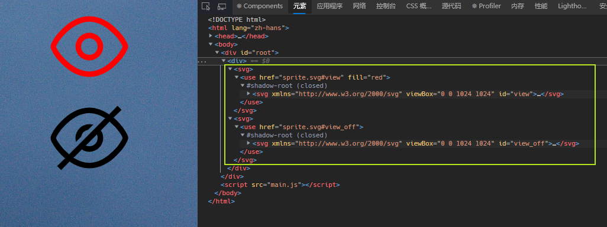

如果要执行打包`yarn build`，需要借助一个 webpack 的插件 —— [`copy-webpack-plugin`](https://github.com/webpack-contrib/copy-webpack-plugin#copy-webpack-plugin)，这个插件可以将指定目录的文件复制到另一个目录中，并且复制过程还可以借助一些工具来压缩文件，例如可以使用[SVGO](https://github.com/svg/svgo/)的工具来优化 SVG 文件

```shell
yarn add copy-webpack-plugin -D
```

```javascript
const CopyPlugin = require('copy-webpack-plugin');

module.exports = {
  plugins: [
    new CopyPlugin({
      patterns: [{ from: 'public/sprite.svg' }], //将sprite.svg复制到打包输出目录
    }),
  ],
};
```

这种方式十分简单，并且能节省 SVG 文件的请求；但是不利于维护，图标更新需要手动修改文件，必须保证每个 SVG 图标的 id 是唯一的，图标越来越多的情况下，很乱，同时无法[按需加载](https://webpack.docschina.org/guides/lazy-loading/)，页面只要包含一个图标文件，整个`sprite.svg`都会被请求加载。

#### svg-sprite-loader

解决按需加载和方便维护的一个方法是使用 JetBrains 出品的[`svg-sprite-loader`](https://github.com/JetBrains/svg-sprite-loader#why-its-cool)，它可以在运行的时候根据组件中引入的 SVG 文件，动态地将这些文件合并成`sprite.svg`，然后插入到 HTML 中，测试一下：

首先，在项目中新建一个专门用来放图标的文件夹`src/assets/icons`，普通的 SVG 图像就不要放进去了，专门用来管理图标的。

把刚才那两个合成`sprite.svg`的图标分开放进去，于是有了下面的目录结构：

```shell
src
├─ assets
│    ├─ icons
│    │    ├─ view.svg
│    │    └─ view_off.svg
│    ├─ images
│    │    ├─ picture.svg
```

在 webpack 中引入`svg-sprite-loader`并配置，需要注意的是使用 webpack 的[`include`](https://webpack.docschina.org/configuration/module/#condition)和`exclude`对不同用处的 SVG 进行区分：

- `url-loader`处理页面中通过``或者在 CSS 中通过`url`引入的 SVG，要忽略掉`src/assets/icons`
- `babel-plugin-inline-react-svg`负责处理组件形式的 SVG，无关
- `svg-sprite-loader`负责处理组件中以`<svg>`标签直接嵌入的形式，只处理`src/assets/icons`

```shell
yarn add svg-sprite-loader -D
```

```javascript
module.exports = {
  module: {
    rules: [
      ...{
        oneOf: [
          {
            test: /\.svg$/i,
            exclude: path.resolve(__dirname, 'src/assets/icons'), //忽略icon文件夹
            use: [
              {
                loader: 'url-loader',
              },
            ],
          },
          {
            test: /\.svg$/i,
            include: path.resolve(__dirname, 'src/assets/icons'), //只处理icon文件夹
            use: 'svg-sprite-loader',
          },
        ],
      },
    ],
  },
};
```

这样在组件中`import`SVG 文件以后，能直接通过`<use>`使用图标：

```jsx | pure
import '../../assets/icons/view.svg';

export default class extends Component {
  render() {
    return (
      <div>
        <svg>
          <use href="#view" />
        </svg>
      </div>
    );
  }
}
```

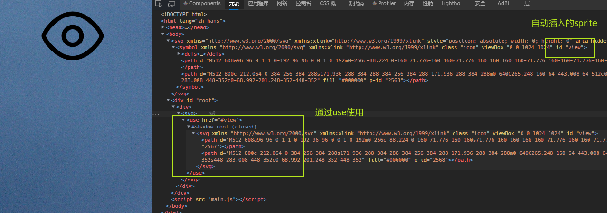

和 CRA 集成 —— https://github.com/JetBrains/svg-sprite-loader/issues/339
