## chunk 和 bundle

> [Concepts - Bundle vs Chunk](https://github.com/webpack/webpack.js.org/issues/970#issuecomment-305525560)

经常让人摸不着头脑的是 chunk 和 bundle 这两个概念。chunk，翻译过来就是大块，也就是代码块；而 bundle 则是束，包的意思。从 webpack 给出的[术语表](https://webpack.js.org/glossary/)中是这么解释的：

> **Chunk**: This webpack-specific term is used internally to manage the bundling process. Bundles are composed out of chunks, of which there are several types (e.g. entry and child). Typically, _chunks_ directly correspond with the output _bundles_ however, there are some configurations that don't yield a one-to-one relationship.
>
> chunk 在 webpack 中用于内部打包的过程；bundle 由 chunk 组成，一般来说，chunk 和 bundle 是对应的，但是也可能通过配置改变它们一一对应的关系。
>
> **Bundle**: Produced from a number of distinct modules, bundles contain the final versions of source files that have already undergone the loading and compilation process.
>
> bundle 由不同的模块组成，包含已经进行加载和经过编译的源文件的最终输出文件。

chunk 属于运行时的概念，webpack 需要根据以上不同的代码类型，查找出所有依赖关系，包括在`node_modules`里的文件，然后合并成 chunk。chunk 有三种类型：

- Entry chunk，包含 webpack 运行时代码；
- Initial chunk，包含由入口`entry`指定的所有模块及其依赖项，整个 chunk 会在 Entry chunk 加载完以后才执行
- Non-initial chunk，包含延迟加载的模块或者异步的代码

bundle 是 webpack 打包最终输出的文件，bundle 是由 chunk 组成的，chunk 就相当于是从 module 到 bundle 转换的中间产物。

## output

webpack 中用来管理输出的配置项主要就是[`output`配置项](https://webpack.docschina.org/configuration/output/)，`output`可选的属性还是很多的，常用的有以下部分：

- `filename`：指定每个打包输出 bundle JS 的名称，如果是只指定`entry`是一个入口文件，那么默认也只会生成一个名称为`main.js`的 bundle 文件。在代码拆分的时候，需要通过 [hash]来指定不同的文件名。
- `chunkFilename`：指定非入口 chunk 的名称，默认是使用 chunk 的 id 来指定，即`[id].js`
- `hashSalt`：hash 加盐是一种密码学中的手段，对需要进行 hash 运算的内容在任意固定位置插入特定的字符串来让加盐后的散列结果和没有加盐的结果不相同。
- `hotUpdateChunkFilename`：自定义热更新 chunk 的文件名，默认是`[name].[hash].hot-update.js`，这里的`[name]`是上面指定的`filename`，例如：

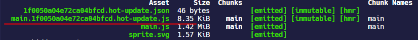

- `scriptType`：指定`<script>`标签插入到页面中的`type`属性，默认是什么都不指定，对于`<script>`标签来说，`type`属性为空，则会将文件看作 JS
- `path`：指定整个项目打包输出的 bundle 的目录，默认是项目根目录的`dist`文件夹
- `publicPath`：开发环境一般用不到这个配置，如果在使用 WDS 的时候，同时指定`publicPath`，就表示提供给 WDS 的文件都来自于`publicPath`目录；但是生产环境下可能用来配置 CDN 的路径前缀
- `sourceMapFilename`：仅在 [`devtool`](https://webpack.docschina.org/configuration/devtool/) 设置为 `'source-map'` 时有效，也就是生成的 source map 的文件名，默认情况下是和 bundle 在同一个目录中
- `ecmaVersion`：控制生成代码的 ES 版本，在 webpack4 中这个值是`5`，在 webpack5 中，这个值是`6`，也就是允许 ES6 代码存在
- `compareBeforeEmit`：在打包输出文件之前，检查文件在目录中是否已经存在，如果存在就不再新写入一个相同的文件，默认是`true`
- `iife`：添加 IIFE 外层包裹的括号，默认是`true`
- `module`：默认是`true`，即允许输出的 JavaScript 文件作为模块类型
- `pathinfo`：在生产环境下默认是`true`，即引入「所包含模块信息」的相关注释；在开发环境下默认是`false`，且建议是`false`

### output.filename

> [webpack - 缓存](https://webpack.docschina.org/guides/caching/#output-filenames)

web 开发中经常遇到的一个问题就是浏览器对资源的缓存，导致发布的新的 JS 文件无法生效；过去解决方式一般是在 JS 的文件名后面添加一串不重复的版本号。在工程化的前端项目里，显然无法通过手动修改文件名来完成替换。

**缓存是有用的，通过代码拆分，我们可以做到将一些不会经常改变的核心代码抽成一个 chunk 进行打包，并赋予一个长期缓存来解决浏览器重复请求网络去加载资源的问题。对于不常更改的 chunk，我们希望每次打包它们的名称都是固定的，而对于经常修改的 chunk，需要根据内容去每次生成一个唯一的 chunk 名称来保证更新客户端的缓存。**

通常 webpack 会为每一个模块分配一个唯一的模块标识符 [`module identifier`](https://webpack.docschina.org/guides/caching/#module-identifiers)，这个 id 是一个 Int 类型的数字，并且通常从`0`开始，依据生产的 chunk 依次递增。

webpack 可以使用一种称为 **substitution(可替换模板字符串)** 的方式，通过使用内容散列(content hash)替换在`output.filename`或`output.chunkFilename`配置的模板字符串来作为输出 bundle 文件的名称，这样在文件内容修改时，会计算出新的 hash，浏览器会使用新的名称加载文件，从而使缓存无效。

具体可以使用的模板字符串见—— [loader-utils.interpolateName](https://github.com/webpack/loader-utils#interpolatename)

| 模板字符串      | 含义                                                         |
| --------------- | ------------------------------------------------------------ |
| `[hash]`        | 根据模块 id 生成的 hash                                      |
| `[contenthash]` | 根据文件内容生成的 hash，每个文件资源都不相同                |
| `[chunkhash]`   | 根据每个 chunk 内容生成的 hash                               |
| `[name]`        | module name，如果 module 没有名称，则会使用其 id 作为名称    |
| `[id]`          | module identifier，默认是根据模块引入的顺序，从`0`开始的整数 |
| `[query]`       |                                                              |
| `[function]`    |                                                              |

在上面的模板字符串中存在三种 hash，默认三种 hash 的长度都是`20`个字符长度，可以通过加 length 的方法`[xxxhash::<length>]`指定 hash 的长度。并且如果开发环境使用 WDS，那么`[contenthash]`无法是用于开发环境的。

第一种`[hash]`，需要注意的是它是根据模块 id 生成的，所以每个 chunk 得到的值都是一样的，在指定代码拆分以后，对其做了测试，可以看到两个 chunk 的 hash 都是一样的。

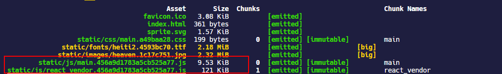

如果修改其中一个 chunk 的模块代码，所有 chunk 的 hash 值都会发生变化，所以使用`[hash]`是不稳定的，达不到上面我们说的目的。

`[chunkhash]`是根据每个 chunk 内容生成的 hash 值，这种情况在有些时候它是稳定的，我在修改单独入口文件的模块代码时，

并未影响其它 chunk 的 hash 值。

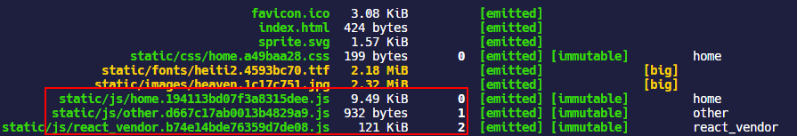

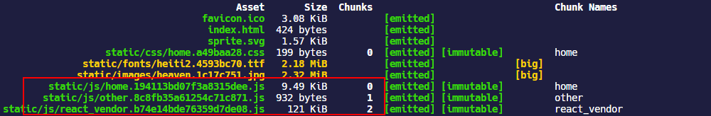

但是当 chunk 内 CSS 和 JS 混杂的时候，例如在 React 中`import`一个单独的 CSS 文件，这是很常见的事，如果对`output.filename`使用了`[chunkhash]`，而对导出的 CSS 也使用了`[chunkhash]`，那么 JS 和 CSS 得到的 hash 值将是一样的，这时候 JS 和 CSS 的变化会相互影响。

```javascript
module.exports = {
  output: {
    filename: isProduction
      ? 'static/js/[name].[chunkhash].js'
      : 'static/js/bundle.js',
    path: path.resolve(__dirname, 'build'),
  },
  plugins: [
    isProduction &&
      new MiniCssExtractPlugin({
        filename: 'static/css/[name].[chunkhash].css',
      }),
    ,
  ],
};
```

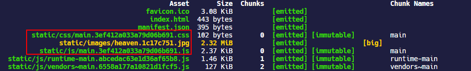

而如果仅对 JS 使用`[chunkhash]`，而 CSS 使用`[contenthash]`，那么 CSS 发生变化，JS 的 hash 名称一样也会变。

```javascript
module.exports = {
  output: {
    filename: isProduction
      ? 'static/js/[name].[chunkhash].js'
      : 'static/js/bundle.js',
    path: path.resolve(__dirname, 'build'),
  },
  plugins: [
    isProduction &&
      new MiniCssExtractPlugin({
        filename: 'static/css/[name].[contenthash].css',
      }),
    ,
  ],
};
```

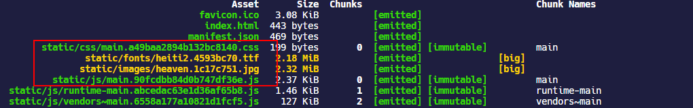

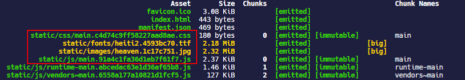

至于`[contenthash]`则是根据具体的模块内容生成的 hash 值，它能检测细微层次 module 的变化，由于 chunk 包含 module，`[contenthash]`是为单个 module 准备的，例如在 JS 文件中`import`一个 CSS 文件，如果对同一个 chunk 中的 JS 和 CSS 都使用`[chunkhash]`来命名，这将导致 CSS 和 JS 的 hash 值永远都是相同的，也就是 JS 变了 CSS 的 hash 值也将变化，CSS 变了 JS 的 hash 值也将变化，例如下面的配置导致的结果是 JS 主 bundle 的 hash 值和 CSS 的 hash 值始终一样。

所以应该对其中一个进行区分，可以都使用`[contenthash]`但不能都用`[chunkhash]`，在使用`[contenthash]`以后，执行打包可以看到当 CSS 变化的时候，main chunk 的 hash 值就不再变化了，而修改当前组件的代码，CSS 的 hash 也不会发生变化。

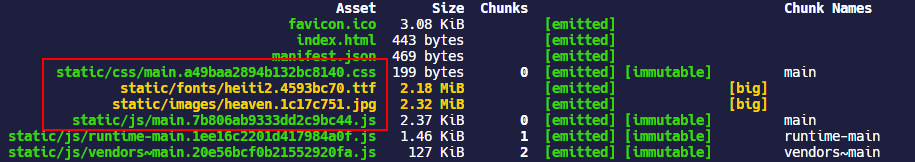

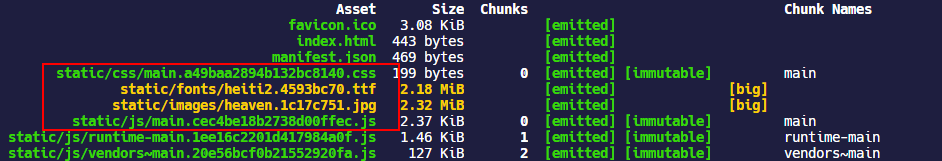

## code splitting

> [developers.google - Extract dependencies and runtime into a separate file](https://developers.google.com/web/fundamentals/performance/webpack/use-long-term-caching#extract_dependencies_and_runtime_into_a_separate_file)

我个人觉得代码拆分最有意义的一个目的是利用客户端的长效缓存机制来避免因为发布导致没有发生更改的第三方依赖被重复请求。

根据 webpack 的[manifest](https://webpack.docschina.org/concepts/manifest/)，在 webpack 构建的过程中，有三种代码类型：

- 开发者编写的程序代码；
- 通过`node_modules`依赖的第三方代码，被称为`vendor` （供应商）；
- webpack 的`runtime`代码，用来连接模块化应用程序所需的所有代码，包含模块交互时，连接模块所需的加载和解析逻辑，这部分逻辑包括已经加载到浏览器中的连接模块逻辑，以及尚未加载模块的延迟加载逻辑。

对于开发者编写的代码，这部分属于经常修改的代码，我们可以单独抽成一个 chunk；对于第三方依赖，例如`react`，`lodash`等创建一个`vendors`chunk，保存所有从`node_modules`引入的模块代码；将第三方库(library)（例如 `lodash` 或 `react`）提取到单独的`vendor` chunk 文件中，是比较推荐的做法，这是因为，它们很少像本地的源代码那样频繁修改，因此通过实现以上步骤，利用 client 的长效缓存机制，命中缓存来消除请求，并减少向 server 获取资源，同时还能保证 client 代码和 server 代码版本一致。而 webpack 的`runtime`代码也可以单独抽成一个 chunk，道理和`vendor` chunk 抽取是一样的。

### 抽取 runtime chunk

使用[`optimization.runtimeChunk`](https://webpack.docschina.org/configuration/optimization/#optimizationruntimechunk)可以将 webpack 的 runtime 代码在生产环境打包的时候拆分成一个单独的 chunk，这种抽取 chunk 的效益和上文提到的利用 client 的长效缓存机制，命中缓存来消除请求的目的是一样的。

`optimization.runtimeChunk`可以传递以下三种类型的值：

- `false`：默认情况下是`false`，每个入口 chunk 中直接嵌入 runtime 的代码

- `'single'`：创建一个在所有生成 chunk 之间共享的运行时文件，更多的情况下是设置成`'single'`，此时会为 runtime 代码单独生成一个 `runtime`前缀的 chunk

```javascript
module.exports = {
  //...
  optimization: {
    runtimeChunk: 'single',
  },
};
```

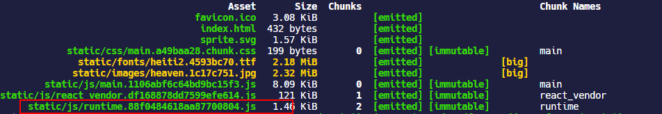

- `true` 或 `'multiple'`：为每个只含有 runtime 的入口添加一个额外 chunk，当我们指定多个入口时，就会根据多个入口每一个生成一个`runtime`的 chunk

```javascript
module.exports = {
  entry: {
    main: './src/index.js',
    other: './src/test.js',
  },
  //...
  optimization: {
    runtimeChunk: true,
  },
};
```

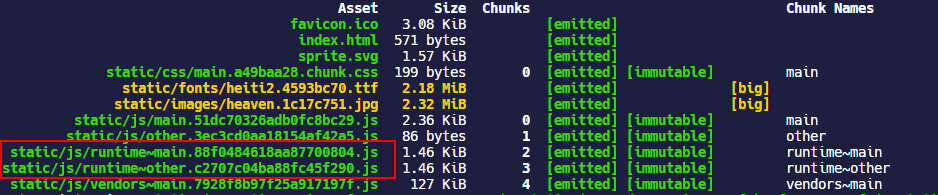

- 设置成一个对象，对象中可以设置只有 `name` 属性，其中属性值可以是名称或者返回名称的函数， 用于为 runtime chunks 命名，例如下面的配置效果和设置成`'single'`是一样的

```javascript
module.exports = {
  //...
  optimization: {
    runtimeChunk: {
      name: 'runtime',
    },
  },
};
```

​ 或者可以给`name`传递一个函数，例如针对每一个 entry 都声称一个 runtime chunk，也就等价于上面`runtimeChunk: true`d 的配置形式。

```javascript
module.exports = {
  entry: {
    main: './src/index.js',
    other: './src/test.js',
  },
  //...
  optimization: {
    runtimeChunk: {
      name: entrypoint => `runtime~${entrypoint.name}`,
    },
  },
};
```

#### 内联 runtime chunk

`runtime`chunk 的代码一般比较小，可以通过 inline `<script>`插入 HTML，减少一此请求过程。使用[`html-webpack-inline-source-plugin`](https://github.com/DustinJackson/html-webpack-inline-source-plugin)可以做到将`runtime`chunk 以 inline 的方式插入 HTML，但是这个插件已经不再维护了，而且最新的 v0.0.10 版本使用有 BUG —— [Cannot read property 'tapAsync' of undefined](https://github.com/DustinJackson/html-webpack-inline-source-plugin/issues/79)，即使按照 issue 提出的解决方法在 HtmlWebpackPlugin 中仍然无法做到将代码插入 HTML。然后找了[`script-ext-html-webpack-plugin`](https://github.com/numical/script-ext-html-webpack-plugin)和`inline-manifest-webpack-plugin`也是一样的问题。

在`html-webpack-inline-source-plugin`的 MD 文档里推荐使用 FB 团队的[`react-dev-utils.InlineChunkHtmlPlugin`](https://github.com/facebook/create-react-app/tree/master/packages/react-dev-utils#new-inlinechunkhtmlpluginhtmlwebpackplugin-htmlwebpackplugin-tests-regex)

```shell
yarn add react-dev-utils -D
```

```javascript
const InlineChunkHtmlPlugin = require('react-dev-utils/InlineChunkHtmlPlugin'); //inline runtime chunk

module.exports = {
  optimization: {
    runtimeChunk: {
      //为每一个入口文件生成的单独的runtime chunk
      name: entrypoint => `runtime-${entrypoint.name}`,
    },
    splitChunks: {
      chunks: 'all',
    },
  },
  plugins: [
    new HtmlWebpackPlugin(),
    isProduction &&
      new InlineChunkHtmlPlugin(HtmlWebpackPlugin, [/runtime-.+[.]js/]),
  ],
};
```

### 抽取 verdor chunk

如果为[`optimization.splitChunks.chunks`](https://webpack.docschina.org/plugins/split-chunks-plugin/#splitchunkschunks)指定了`all`，那么是会默认将`node_modules`引入的模块拆分成一个 chunk；

```javascript
module.exports = {
  //...
  optimization: {
    splitChunks: {
      // include all types of chunks
      chunks: 'all',
    },
  },
};
```

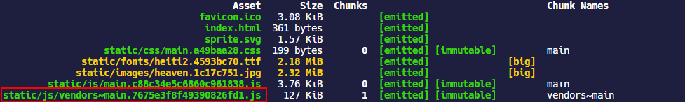

### entry

从`entry`入口可以进行自定义代码拆分，首先看一下`entry`这个配置，可以是`String/Object/Function`类型的配置：

- 如果传入一个字符串或字符串数组，只会生成一个 chunk，并会被命名为 `main`
- 如果传入一个函数，会在每次编译的时候被调用，然后返回一个入口文件路径，也就是**动态入口**
- 如果传入一个对象，则每个属性的键会是对应生成的 chunk 的名称前缀`[name]`，则属性的值是 chunk 的入口文件路径，默认情况下，入口 chunk 的输出文件名也是从 [`output.filename`](https://webpack.docschina.org/configuration/output/#outputfilename) 中提取出来的

```javascript
module.exports = {
  //...
  entry: {
    home: './src/index.js',
    other: './src/test.js',
  },
};
```

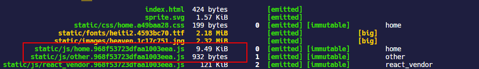

默认情况下，每个入口 chunk 会保存全部使用到的模块，可以使用`dependOn`可以定义在多个 chunk 之间共享的模块，例如下面的配置方式。需要注意的是`dependOn`只在**webpack@5.0.0-beta.14**版本后才能用：

```javascript
module.exports = {
  //...
  entry: {
    home: './home.js',
    index: { import: './src/index.js', dependOn: 'shared' },
    another: { import: './src/another-module.js', dependOn: 'shared' },
    shared: ['react', 'react-dom', 'redux', 'react-redux'],
  },
};
```

### SplitChunksPlugin

从 webpack4 以后，`CommonsChunkPlugin`被`SplitChunksPlugin`替换，以前的`CommonsChunkPlugin`配置很复杂，需要为 vendor，webpack 的执行代码，异步加载的模块等分开配置，这些配置甚至都形成了模板配置，用的时候复制过来就行。

而 webpack4 引入的`SplitChunksPlugin`是开箱即用的，默认情况下，webpack 会在生产环境打包的时候对满足以下条件的模块自动拆分出一个 chunk 来包含它：

- 新的 chunk 被两个及以上模块引用，或者 chunk 内的 module 来自于`node_modules`文件夹；
- 新的 chunk 在压缩前大于`20kB`
- 并行请求的 chunk 最大数量要`<= 30`；
- 初始页面加载时并行请求的最大数量要`<= 30`

例如，下面的代码中通过`import()`动态导入模块，这种情况下，会为从`node_modules`中引入的`react`模块单独创建一个 chunk，新的 chunk 默认使用模块模块 id 来命名，也就是形如`0.[hash].js`的形式；这个 chunk 会在请求 `./a`的时候被并行请求加载。

```javascript
// index.js
// 通过import()属于async导入的模块

import('./a');

// a.js
import React from 'react';
```

#### optimization.splitChunks

通过配置项`optimization.splitChunks`可以自由的定制 webpack 抽取 chunk 的方式，webpack 对`optimization.splitChunks`的默认配置是：

```javascript
module.exports = {
  //...
  optimization: {
    splitChunks: {
      chunks: 'all',
      minSize: 20000,
      minRemainingSize: 0,
      maxSize: 0,
      minChunks: 1,
      maxAsyncRequests: 30,
      maxInitialRequests: 30,
      automaticNameDelimiter: '~',
      enforceSizeThreshold: 50000,
      cacheGroups: {
        defaultVendors: {
          test: /[\\/]node_modules[\\/]/,
          priority: -10,
        },
        default: {
          minChunks: 2,
          priority: -20,
          reuseExistingChunk: true,
        },
      },
    },
  },
};
```

- `automaticNameDelimiter`：默认是`~`，定义 chunk 类型和 chunk 名称之间的分界符，例如`vendors~main.js`

- `chunks`：可以是一个字符串`'all'|'async'|'initial'`，分别代表了全部 chunk，按需加载的 chunk 以及初始加载的 chunk；也可以是一个函数，函数会接收`chunk.name`作为参数。

- `maxAsyncRequests` ：按需加载时的最大并行请求数，默认是`30`

- `maxInitialRequests`：入口点的最大并行请求数，默认是`30`

- `minChunks`：拆分 chunk 的时候，共享该 chunk 的最小模块数量，至少是`1`

- `minSize`：生成 chunk 的最小字节数，默认是`20000`，也就是大概`20KB`

- `enforceSizeThreshold`：强制执行拆分的大小阈值，默认是`50000`，也就是`50KB`

- `minRemainingSize`：webpack5 引入的新属性，指定拆分 chunk 后最小 chunk 的大小，在开发模式`mode=development`默认是`0`，在其他情况下，这个值取决于`splitChunks.minSize`

- `maxSize`：把超过`maxSize`的 chunk 进行拆分，每个 chunk 最小大小是`minSize`指定的。`maxSize`选项旨在与 HTTP / 2 和长期缓存一起使用，它增加了请求数量以实现更好的缓存。它还可以用于减小文件大小，以加快重建速度。从优先级方面来讲，`maxInitialRequest/maxAsyncRequests < maxSize < minSize`；设置 maxSize 的值会同时设置`maxAsyncSize`和`maxInitialSize`的值

- `maxAsyncSize`：`maxAsyncSize`仅会影响按需加载的 chunk

- `maxInitialSize`：`maxInitialSize`仅会影响初始加载的 chunk

- `name`：拆分生成的 chunk 名称，对于生产版本，建议将`splitChunks.name`设置为`false`，以免不必要地更改名称

- `automaticNamePrefix`：为创建的 chunk 设置名称前缀

- `cacheGroups`：每个`cacheGroups`都可以定义自己抽取模块的范围，也就是哪些文件中的公共代码会抽取到自己这个 chunk 中；
  - `test`属性用于匹配模块的名称，默认是`/[\\/]node_modules[\\/]/`，因为从 node_modules 中加载的依赖路径中都带有 `node_modules`前缀字符串，所以这个正则表达式也就是匹配所有从 node_modules 中加载的依赖
  - 不同的 cacheGroups 之间的模块范围如果有交集，可以用`priority` 属性控制优先级；
  - `reuseExistingChunk`指定如果当前块包含已从主 bundle 中拆分出的模块，那么会被重用
  - `name`：拆分的 chunk 的名称，可以传递一个函数，这个属性比较常用
  - `filename`：只能用于初始加载的 chunk，使用`filename`重写其名称
  - `enforce`：忽略`minsize`，`minChunks`，`maxAsyncRequests` 和`maxInitialRequests`的限制，总是为当前 cache group 创建 chunk
  - `idHint`：设置 chunk 的 id，它会被添加到 chunk 的文件名中

#### optimization.splitChunks.cacheGroups

`cacheGroups`是十分强大的自定义 chunk 抽取的配置，对于上文说到的提取第三方依赖的`vendor`，也可以通过`cacheGroups`来定义实现，因为通过`import`导入第三方依赖的模块都会带有`node_modules`的前缀，所以利用`cacheGroups`的`test`属性匹配第三方依赖来生成`chunk`

```javascript
module.exports = {
  //...
  optimization: {
    splitChunks: {
      cacheGroups: {
        commons: {
          test: /[\\/]node_modules[\\/]/,
          name: 'vendors',
          chunks: 'all',
        },
      },
    },
  },
};
```

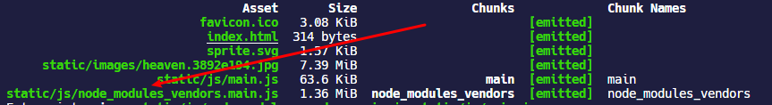

创建一个`commons`chunk，用来保存在所有入口模块之间共享的模块代码；但是这种配置会增加初始 bundle 的大小，还是建议使用动态导入来解决

```javascript
module.exports = {
  //...
  optimization: {
    splitChunks: {
      cacheGroups: {
        commons: {
          name: 'commons',
          chunks: 'initial',
          minChunks: 2,
        },
      },
    },
  },
};
```

创建一个`react_vendor`chunk，将`react`和`react-dom`放在一个 chunk 内

```javascript
module.exports = {
  //...
  optimization: {
    splitChunks: {
      cacheGroups: {
        commons: {
          test: /[\\/]node_modules[\\/]/,
          name: 'vendors',
          chunks: 'all',
        },
        react_vendor: {
          test: /[\\/]react|react-dom[\\/]/,
          name: 'react_vendor',
          chunks: 'all',
        },
      },
    },
  },
};
```

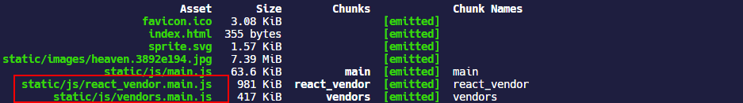

## clean-webpack-plugin

当使用`[contenthash]`替换 chunk 名称的时候，对于修改过的 chunk，每次都会生成一个具有新的 chunk 名的 chunk，而旧的 chunk 会依然保留在`output.path`文件夹中，这些垃圾文件会随着每次 build 越来越多。

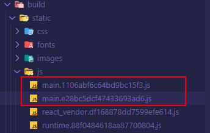

[`clean-webpack-plugin`](https://github.com/johnagan/clean-webpack-plugin)是负责清理 build 文件夹的插件，默认情况下，这个插件会清空在`output.path`文件夹里的所有文件，以及每次成功重建后所有未使用的 webpack 静态资源。现在这个插件已经到了 V3.0 版本。

```shell
yarn add clean-webpack-plugin -D
```

```javascript
// 需要注意这里要带括号
const { CleanWebpackPlugin } = require('clean-webpack-plugin'); //清理build文件夹

module.exports = {
  plugins: [isProduction && new CleanWebpackPlugin()],
};
```


