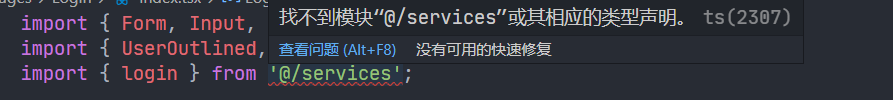

## Q&A

### typescript配置alias别名报错

```javascript
Cannot find module '@/services' or its corresponding type declarations.  TS2307
```



在`typescript`的`tsconfig.json`文件中声明别名的配置路径即可：

```json
{
  "compilerOptions": {
    "baseUrl": "src",
    "paths": {
      "@/*": ["./*"]
    }
  },
  "include": ["src"]
}
```

或者也可以这样配置，总之明确两点：

- `baseUrl`指定相对于`tsconfig.json`的路径
- 而`paths`的路径映射最终又是相对于`baseUrl`的路径

```json
{
  "compilerOptions": {
    "baseUrl": "./",
    "paths": {
      "@/*": ["src/*"]
    }
  },
  "include": ["src"]
}
```

